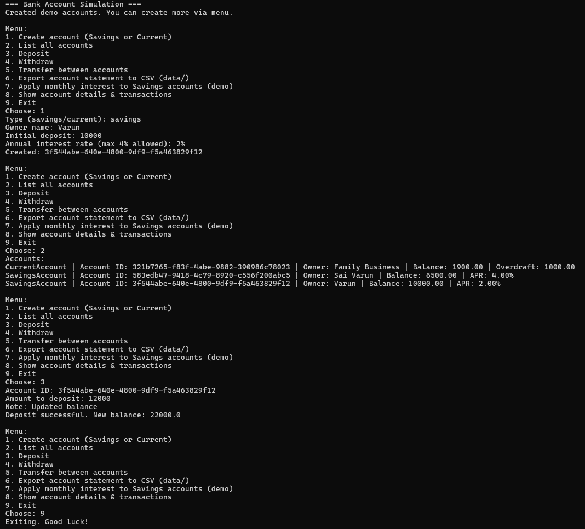

# Bank Account Simulation

A **Java OOP project** simulating core banking operations like deposits, withdrawals, transfers, interest calculation, and account statements - complete with transaction history and CSV export.

##  Features

- **Account Types**:
  - SavingsAccount - with monthly interest (max 4%).
  - CurrentAccount - with overdraft limit.
- **Transactions**:
  - Deposit, Withdraw, Transfer between accounts.
  - Automatic transaction history tracking.
- **Data Export**:
  - Export account statement as a CSV file in /data.
- **OOP Concepts**:
  - Inheritance, Polymorphism, Encapsulation, Abstraction.
- **Interactive CLI**:
  - Menu-driven interface for smooth user experience.

---

##  Sample Output



---

##  How to Run

### 1 Compile 
```bash
javac -d bin src\*.java
```
###  2 Run 
```bash
cd bin
java Main
```

## Example CSV Export ##
- Account ID,Owner,Type,Amount,Date,Note,BalanceAfter
- 123456,Sai Varun,DEPOSIT,5000,2025-08-11 10:15:30,Initial deposit,5000
- 123456,Sai Varun,WITHDRAWAL,1000,2025-08-12 11:45:10,Groceries,4000

## Future Improvements ##

- Database persistence (SQLite / MySQL).
- GUI interface using JavaFX.
- Multi-threaded transaction handling.
- JUnit test coverage.
